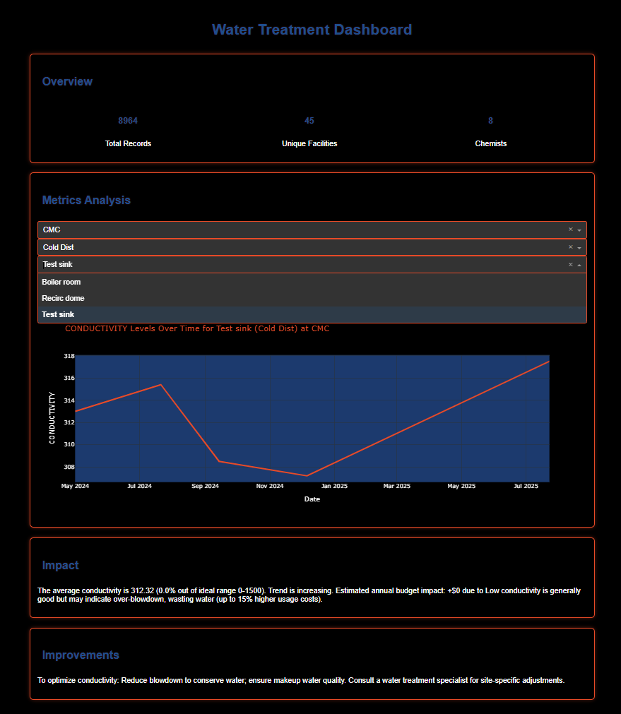

# Water Treatment Report Processing and Dashboard

This project automates the transformation of legacy water testing reports (PDFs and DOCX) into a modern, interactive dashboard for water quality analysis.

## Quick Start
- **Interactive Notebook**: Explore the pipeline in [jupyter_nb/IWT_Dashboard.ipynb](jupyter_nb/IWT_Dashboard.ipynb).
- **Live Dashboard**: Run `Water_line/app.py` to launch the Dash app (see setup below).
- **Visualization**: 

## Setup
1. Clone: `git clone https://github.com/Markopolo2023/Water_line.git`
2. Install: `pip install -r requirements.txt`
3. Run Notebook: `jupyter notebook notebook/Water_Treatment_Dashboard.ipynb`
4. Run Dashboard: `python Water_line/app.py`

## Skills Demonstrated
- Data extraction from unstructured PDFs/DOCX.
- ETL pipeline with SQLite storage.
- Interactive visualization with Dash/Plotly.

## Note
Data files are excluded for privacy. Contact me for a demo with sample data.
